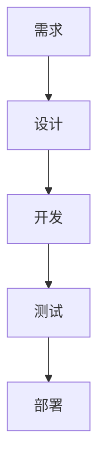

# {{project_name}}：AGENTS.md

本文件是项目的单一协作事实来源：目录边界、产物路径、流程门禁、运行方式与质量要求以此为准。

## 项目信息（可逐步补全）

- 项目描述：
- 项目目标：
- 创建日期：YYYY-MM-DD
- 当前阶段：需求 / 设计 / 开发 / 测试 / 部署

## 必须遵守（门禁）

- 先文档，后代码：实现前先更新 docs/，不得把关键信息只留在对话里
- 工程边界：只在 source/ 内改代码，禁止把代码散落到 docs/ 与 references/
- 双重确认：AI 自检通过 + 用户确认后，才进入下一阶段或提交代码改动
- 密钥不入库：所有密钥只放本地环境或 CI 密钥管理

## 目录与产物

- docs/：文档单一来源（本仓库的最新版本）
- source/：工程代码（仅在此目录内改代码）
- references/：历史资料、素材、用户背景输入（只读参考）

docs/ 结构：

- docs/requirements/PRD.md：需求与验收
- docs/requirements/REQUIREMENTS.md：需求清单与追溯（可选）
- docs/design/SPEC.md：方案与设计
- docs/decisions/：关键决策（ADR-xxxx）
- docs/testing/TEST_PLAN.md：测试计划与回归清单
- docs/changelog/CHANGELOG.md：变更记录（先计划，后已实现）
- docs/release/RELEASE.md：发布与部署清单（含回滚与验证）

## 阶段顺序（建议）



默认工作流（每次迭代从这里开始）：

1. 需求澄清：目标、范围、非目标、约束、验收标准
2. 需求文档：更新 docs/requirements/PRD.md
3. 变更记录：更新 docs/changelog/CHANGELOG.md
4. 方案设计：更新 docs/design/SPEC.md
5. 决策记录：关键取舍时更新 docs/decisions/（新增 ADR-xxxx）
6. 实现计划：任务拆解、依赖、风险、回滚与检查项
7. 开发实现：只改 source/ 下代码
8. 测试验证：更新 docs/testing/TEST_PLAN.md
9. 发布部署：更新 docs/release/RELEASE.md

## 角色与路由

| 角色 | 主要职责 | 关键产出 |
|---|---|---|
| @product | 需求澄清、需求文档、验收标准与边界 | PRD |
| @design | UI/UX、交互流程、可用性检查 | 交互与实现建议 |
| @architect | 架构/API/数据方案与权衡 | SPEC、ADR |
| @fullstack | 端到端实现、联调、落地门禁 | 可运行交付 |
| @qa | 测试计划、用例、回归清单、缺陷闭环 | TEST_PLAN |

- 用户明确指定角色或阶段时，优先按指定执行
- 工具不支持 @role 时，用自然语言声明当前角色并按职责执行
- 需要跨角色时，自动拆解任务并按阶段顺序串行推进

## 环境、运行与质量

环境约定：

- `.env.example`：只包含变量名与说明，不包含真实值
- `.env`：本地私有文件，不提交

常见变量（按项目实际补充）：

- API_KEY：
- API_ENDPOINT：

首次安装：

```bash
<your-install-command>
```

本地启动：

```bash
<your-dev-command>
```

交付前验证：

```bash
<your-test-command>
<your-lint-command>
<your-typecheck-command>
```

如果项目暂无自动化测试，也必须在 docs/testing/TEST_PLAN.md 记录手工验证步骤与回归清单。

## 附录（可按项目删改）

### A. 代码风格（当 source/ 出现代码后生效）

- 缩进 2 空格
- 单行尽量 80 字符内，务必不超过 100
- 优先 git diff 友好：列表/对象项的末尾逗号风格保持一致
- 复用纯函数，避免项目内重复实现
- Vue 场景：v-if="false" 的临时隐藏块不要删除
- 禁止用 bind/apply/call/map/filter/reduce 作为业务 API 命名

### B. 样式规范（默认规则，可被项目现状覆盖）

- 默认优先使用 TailwindCSS 原子化类
- 如果项目模板已使用 UnoCSS 等其他原子化方案，遵循项目既有选择
- 原子化样式中可适度增加可读性类名，便于识别业务区块

### C. 输出语言

- 默认中文
- 需要英文效果更好的内容可中英对照输出
